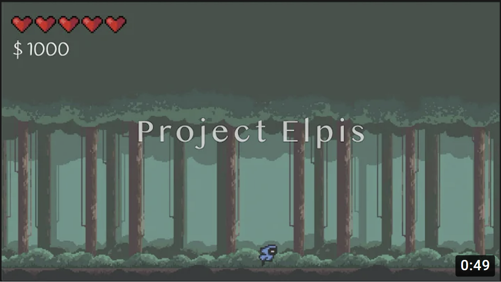

# Project Elpis

# TASKS

## Katherine
- [x] Basic movement
- [x] Portals
- [x] Mobs
- [x] Hurtbox/Hitbox
- [x] Health
- [x] New World
- [x] Organize folders
- [x] Dashing
- [x] fix jump attacks
- [x] Checkpoints
- [x] NPCs
- [x] Dialogue boxes
- [ ] First Boss

## Kevin
- [x] Items
- [x] Inventory
- [x] Toggle to hide inventory display
- [x] Make UI move along with player
- [x] Corner notifications

- [x] Delivery NPCs
- [x] Fix NPC bug (player pauses mid-air)
- [x] Merchant NPCs (shop UI)
  - dont display slot subscript
  - escape to exit merchant menu
  - deduct and check money left
  - display price
  - disable interact when merchant or inventory menu is open
  - display how much of the item the player has
- [x] Drachma display

- [ ] NPC "talked-to" state
- [ ] Large text display, announcing the storyline
- [ ] Need to redesign popup notifications
- [ ] Popup confirmation menus
- [ ] Scattering loot that floats into the player
- [ ] Crafting system

## Misc
- Pseudo-quests
- Projectiles
- Saving
- More UI
- Chests

